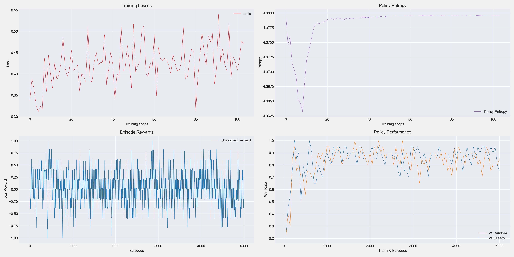

# Tic-Tac-Toe Assignment for Reinforcement Learning
HKUST MSBD6000M course project for the Tic-Tac-Toe Assignment in Reinforcement Learning
## Introduction
This project implements an AI agent for Tic-Tac-Toe based on reinforcement learning techniques, specifically utilizing the Proximal Policy Optimization (PPO) algorithm - a state-of-the-art policy gradient method in modern reinforcement learning. The primary objective of this research is to develop and train a high-performing AI agent capable of exhibiting superior gameplay in the CrossTicTacToe variant.

### Game Environment
The game environment is designed as a 12×12 board where only specific regions are designated as valid placement areas: top, bottom, left, right, and center regions.

The game follows these rules:

- Players take turns placing their pieces on the board
- Victory is achieved by connecting 4 pieces horizontally or vertically, or 5 pieces diagonally
### Training Framework
The environment is formulated as a Markov Decision Process (MDP):

- States represent the current board configuration
- Actions correspond to piece placement in valid positions
- Reward structure: +1 for winning, -1 for losing
- A small penalty of -0.01 is applied per action to incentivize faster victories
### Algorithm Architecture
We implemented the PPO reinforcement learning algorithm with the following components:

- Convolutional neural networks for processing board state representations
- A PPONet utilizing an Actor-Critic architecture comprising both policy and value networks
- Experience replay buffer for storing and sampling training data
- Entropy regularization to promote policy exploration
- Proximal policy updates to prevent excessive policy shifts during training iterations
### Evaluation
The agent's performance is evaluated through:

- Competitive gameplay against both random and greedy baseline strategies
- Tracking of loss functions and KL-divergence measures, demonstrating the characteristic bow-shaped learning curve
- Visualization of gameplay progression and decision-making processes

## Code Implement

checkpoints can be downloaded in https://drive.google.com/drive/folders/1pgTkoPjANQoqqUILBitOKMJlXkJ121Ol?usp=sharing
```
# train
python train_ppo.py --episodes 5000

# test
python test_ppo.py
```

## Training results


The figure above illustrates the training metrics of our PPO agent. The training curves demonstrate steady performance improvement as the number of training iterations increases. Key observations include:

- Training Loss: As training progresses, the loss values show an overall downward trend, indicating gradual convergence of model parameters. The fluctuations reflect the inherent exploration process characteristic of reinforcement learning.
- Policy Entropy: The initially high entropy values indicate that the agent is exploring a wide range of possible actions. As training advances, entropy gradually decreases, suggesting that the policy becomes more deterministic and focuses on effective strategies.
- Episode Reward: The reward curve shows an upward trend, demonstrating that the agent progressively learns strategies that yield higher returns. The growth in rewards indicates continuous improvement in the agent's game performance.
- Win Rate: The win rate curve exhibits an upward trajectory, confirming that the agent has learned effective gameplay strategies.

Through approximately 5,000 training iterations, the agent successfully acquired effective strategies for the CrossTicTacToe game and demonstrates the ability to defeat baseline opponent strategies.

## Test results

### random policy


The GIF above demonstrates our PPO agent competing against an opponent using a random strategy. It can be observed that the agent consistently defends against random placements while effectively building its own connecting lines, ultimately achieving victory. The agent exhibits strong capabilities in identifying critical positions and demonstrates strategic planning abilities throughout the gameplay.


### Greedy policy


This demonstration showcases the PPO agent competing against an opponent using a greedy strategy. The greedy strategy prioritizes positions that lead to immediate victory or blocks the opponent from winning, thus presenting a significantly more challenging adversary than a random policy. Even when facing such a sophisticated opponent, our agent demonstrates excellent strategic thinking, anticipating the opponent's moves to set up traps and secure victories.
