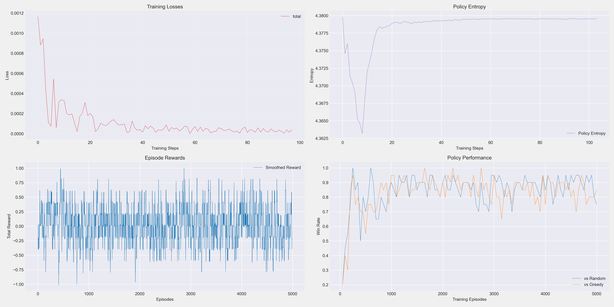

# Tic-Tac-Toe Assignment for Reinforcement Learning
HKUST MSBD6000M course project for the Tic-Tac-Toe Assignment in Reinforcement Learning
## Introduction
This project implements a reinforcement learning system based on the Proximal Policy Optimization (PPO) algorithm, aimed at training AI agents that excel in the Cross Tic-Tac-Toe game. As a variant of the classic two-player zero-sum game, Cross Tic-Tac-Toe provides an ideal environment to demonstrate the application of reinforcement learning algorithms in strategic decision-making.

The game is played on a 12×12 board, where players take turns placing pieces within specific valid areas. Victory is achieved by connecting 4 pieces horizontally or vertically, or 5 pieces diagonally. This environment is constructed as a Markov Decision Process (MDP), where the agent optimizes its decision-making strategy through interaction with the environment.

The main contributions of this project include:

- Training a Tic-Tac-Toe agent using the PPO algorithm, which combines policy gradient methods and value function approximation
- Designing specific reward shaping mechanisms to enhance learning efficiency
- Implementing policy and value networks based on convolutional neural networks
- Providing performance evaluations against benchmark opponents using random and greedy strategies
The project structure is divided into four main components: environment definition (env.py), model design (model.py), training implementation (train_ppo.py), and testing evaluation (test_ppo.py). Through systematic training and evaluation, this project demonstrates the potential applications of reinforcement learning in strategic games.

## Code Implement

checkpoints can be downloaded in https://drive.google.com/drive/folders/1pgTkoPjANQoqqUILBitOKMJlXkJ121Ol?usp=sharing
```
# train
python train_ppo.py --episodes 5000

# test
python test_ppo.py
```

## Training results


The figure above illustrates the training metrics of our PPO agent. The training curves demonstrate steady performance improvement as the number of training iterations increases. Key observations include:

- **Training Loss**: The training loss curve demonstrates a typical PPO training pattern of "initial volatility followed by gradual stabilization." Specifically, in the initial phase, loss values are high with significant fluctuations and pronounced oscillations. During the middle phase, the trend shifts downward with reduced yet rhythmic fluctuations. In the later phase, loss values maintain a relatively low and stable level with minimal variations. This pattern is expected as PPO's total loss comprises policy loss, value loss, and entropy regularization components, with learning rate decay implemented every 200 rounds in the code. This behavior aligns with theoretical expectations for PPO algorithms, indicating that the training process successfully balanced exploration and exploitation before converging to an effective policy.
- **Policy Entropy**: The entropy trend follows a pattern of initially high values, followed by a decrease, and then a gradual increase while remaining below initial values. This reflects three distinct phases of policy learning, consistent with typical PPO training trajectories:
    - Initial high-entropy phase: When training begins, the policy is random with action probabilities approaching a uniform distribution, resulting in high entropy values.
    - Rapid decline phase: As learning progresses, the model develops preferences for certain actions, concentrating the distribution and causing entropy to decrease quickly.
    - Gradual rise phase: When the model identifies states requiring additional exploration, it appropriately increases entropy, though typically not returning to initial random levels.
    - The entropy settling below its initial value while maintaining a certain level is ideal, indicating that the model has achieved a balance between deterministic decision-making and appropriate exploratory capacity.
- **Episode Reward**: The relatively stable reward curve can be attributed to:
    - Reward Shaping Mechanism: The project employs a sophisticated RewardShaper class to enhance the original reward signals, taking into account multiple factors including positional value, connection potential, blocking potential, and regional control.
    - Stable Policy Performance: The policy learned by the agent tends to stabilize in the later stages of training, resulting in a balanced distribution of shaped rewards.
- **Win Rate**: The win rate curve exhibits an upward trajectory, confirming that the agent has learned effective gameplay strategies.

Through approximately 5,000 training iterations, the agent successfully acquired effective strategies for the CrossTicTacToe game and demonstrates the ability to defeat baseline opponent strategies.

## Test results

### random policy


The GIF above demonstrates our PPO agent competing against an opponent using a random strategy. It can be observed that the agent consistently defends against random placements while effectively building its own connecting lines, ultimately achieving victory. The agent exhibits strong capabilities in identifying critical positions and demonstrates strategic planning abilities throughout the gameplay.


### Greedy policy


This demonstration showcases the PPO agent competing against an opponent using a greedy strategy. The greedy strategy prioritizes positions that lead to immediate victory or blocks the opponent from winning, thus presenting a significantly more challenging adversary than a random policy. Even when facing such a sophisticated opponent, our agent demonstrates excellent strategic thinking, anticipating the opponent's moves to set up traps and secure victories.


